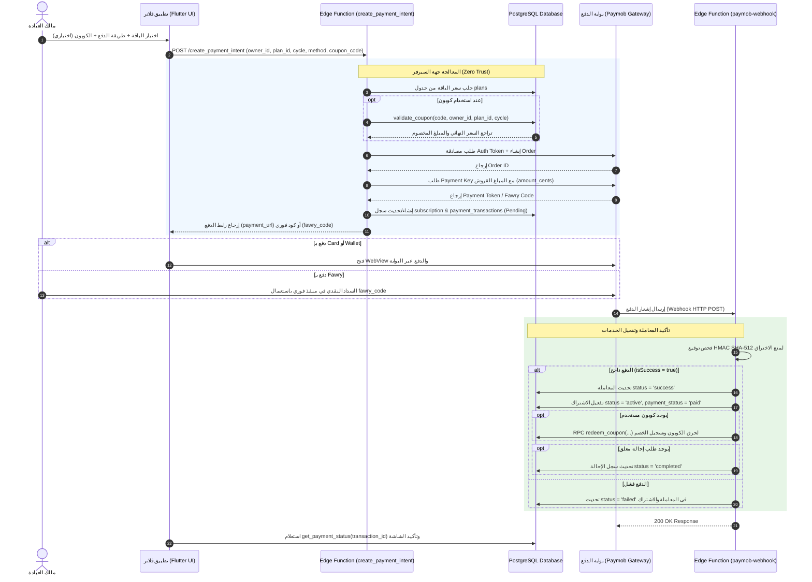

# الدليل الشامل لمنطق العمل والـ Workflows: نظام الدفع والاشتراكات (Payment & Subscriptions System)

---

## 1. المعمارية العامة ومبدأ العمل (Architecture Overview)

يعتمد نظام الدفع والاشتراكات في **Clinic Pro** بالكامل على معمارية **Zero Client Trust (معالجة السيرفر الآمنة بنسبة 100%)** لحماية المعاملات المالية ومنع أي تلاعب بالأسعار أو تجاوز فترات الاشتراكات:

1. **حساب الأسعار والخصومات في السيرفر:** لا تملك الواجهة الأمامية (`Flutter Client`) إمكانية إرسال مبالغ مالية أو خصومات. يتم جلب أسعار الباقات مباشرة من جدول `plans` وقيم الكوبونات عبر RPC `validate_coupon` في قاعدة البيانات.
2. **المعالجة عبر Supabase Edge Functions:** 
   - **`create_payment_intent`**: دالة سيرفر من سحابة Deno تُنشئ الطلب وتتواصل مع بوابة الدفع **Paymob** بصلاحيات الـ `service_role` للالتفاف على RLS وإلزام العميل بالسعر الحقيقي.
   - **`paymob-webhook`**: دالة سيرفر تستقبل إشعارات الدفع من Paymob، تتحقق من توقيع التشفير `HMAC SHA-512` لتأكيد صحة الإشعار، ثم تقوم بتفعيل الاشتراك وحرق الكوبون وإكمال الإحالة تلقائياً.
3. **طرق الدفع المدعومة (Payment Methods):**
   - **البطاقات البنكية (`card`):** عبر توكين التوجيه للـ Iframe البنكي المعتمد.
   - **المحافظ الإلكترونية (`wallet`):** كخدمات كاش (Vodafone Cash, Orange, Etisalat, WE) مع التوجيه لتأكيد الخصم المباشر.
   - **فوري (`fawry`):** توليد كود الدفع مرجعي (`fawry_code`) مع إمكانية السداد من أي منفذ.
4. **مبدأ التكرارية الآمنة (Idempotency):** عند قيام المستخدم بالبدء في عملية دفع جديدة مع وجود معاملة معلقة (`pending` / `failed`) لنفس الباقة، يعيد النظام استخدام نفس سجل الاشتراك والمعاملة بدلاً من تكرار الإدخال في قاعدة البيانات.
5. **سياسات الأمان وقواعد الـ RLS (Row Level Security):**
   - يمنع جدول `payment_transactions` عمليات الإدراج المباشرة من العميل (`anon` / `authenticated`).
   - الإدراج والتعديل يقتصران حصرياً على الـ Edge Functions المعتمدة بصلاحية `service_role`.

---

## 2. مخطط تدفق عملية الدفع الشاملة (Payment & Webhook Workflow)



---

## 3. الجداول وقواعد البيانات الخاصة بنظام الدفع

### 1. `subscriptions` (تحديث حقول الدفع)
- **الحقول المضافة:**
  - `payment_method`: طريقة الدفع (`manual` يدوي من الأدمن أو `paymob`).
  - `transaction_id`: معرّف المعاملة المكتملة بنجاح من البوابة.
  - `payment_status`: حالة سداد الاشتراك (`none`, `pending`, `paid`, `failed`, `refunded`).

### 2. `payment_transactions` (سجل المعاملات المالية)
- **الحقول الأساسية:**
  - `id`: المعرف الفريد للمعاملة (UUID).
  - `subscription_id`: معرّف الاشتراك المرتبط (FK -> `subscriptions.id`).
  - `owner_id`: معرّف الطبيب مالك العيادة (FK -> `users.id`).
  - `gateway`: اسم بوابة الدفع (`paymob`).
  - `payment_method`: طريقة السداد (`card`, `wallet`, `fawry`).
  - `gateway_order_id`: معرّف الطلب في بوابة Paymob.
  - `gateway_transaction_id`: معرّف المعاملة البنكية الصادرة من البنك/البوابة.
  - `amount`: المبلغ المدفوع بالجنيه المصري (EGP).
  - `currency`: العملة (`EGP`).
  - `status`: حالة المعاملة (`pending`, `success`, `failed`, `refunded`).
  - `error_message`: تفاصيل نص الخطأ إن وجدت.
  - `metadata`: كائن JSON ينطوي على بيانات الباقة، تفاصيل الكوبون، وكود فوري.

---

## 4. الـ Edge Functions و الـ RPCs الرئيسية

| المكون / الوظيفة | النوع | الوصف والمسؤولية |
| :--- | :--- | :--- |
| `create_payment_intent` | Edge Function | استقبال طلب الدفع من الموبايل، التحقق من الأسعار والكوبونات بالسيرفر، تواصل آمن مع APIs الخاصة بـ Paymob وإرجاع رابط الدفع أو كود فوري. |
| `paymob-webhook` | Edge Function | استقبال إشعارات الدفع من Paymob، فحص التشفير HMAC-SHA512، تفعيل الاشتراكات، حرق الكوبونات، واكتمال الإحالات بالسيرفر. |
| `get_payment_status(p_transaction_id)` | RPC Function | استعلام سريع تستدعيه واجهة Flutter لمعرفة حالة المعاملة الحالية وتأكيد الشاشة للطبيب فور عودته من البوابة. |
| `validate_coupon(...)` | RPC Function | فحص الكوبون وحساب المبلغ النهائي والخصم بالسيرفر لحماية عملية الدفع قبل إنشائها. |
| `redeem_coupon(...)` | RPC Function | حرق واستعراض الكوبون المستهلك وتمديد مدة الاشتراك عند إتمام عملية الدفع بنجاح. |

---

## 5. قواعد الأمان والـ RLS (Row Level Security)

```sql
-- تفعيل حماية RLS لجدول المعاملات المالية
ALTER TABLE payment_transactions ENABLE ROW LEVEL SECURITY;

-- المالك فقط يستطيع القراءة والرؤية لمعاملاته الشخصية
CREATE POLICY "owners_view_own_transactions"
  ON payment_transactions FOR SELECT
  USING (auth.uid() = owner_id);

-- يقتصر الإدراج والتعديل حصرياً على الـ Service Role عبر Edge Functions
```

- **تنبيه أمني:** لا يملك تطبيق الموبايل إمكانية إدراج أو تعديل حالة المعاملة في جدول `payment_transactions` أو جدول `subscriptions` مباشرة، مما يمنع نهائياً تزييف حالة الدفع أو تمديد الاشتراكات بطرق غير مشروعة.
