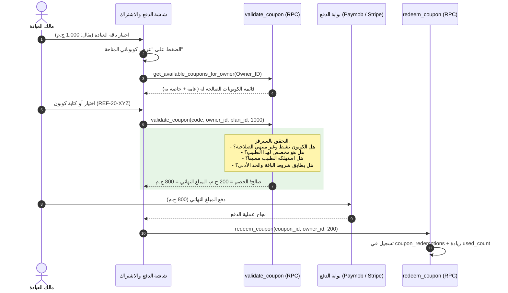

# الدليل الشامل لمنطق العمل والـ Workflows: نظام الكوبونات والخصومات (Coupons System)

---

## 1. المعمارية العامة ومبدأ العمل (Architecture Overview)

يعتمد نظام الكوبونات بالكامل على مبدأ **Zero Client Trust (معالجة السيرفر الآمنة)** لمنع أي تلاعب بالأسعار أو استغلال الخصومات:
1. **التحقق وحساب الخصم:** يتم كلياً داخل قاعدة البيانات عبر RPC `validate_coupon`، حيث يُحسب الخصم والمبلغ الإجمالي بعد تطبيق الشروط.
2. **أنواع الكوبونات (Coupons Scopes):**
   - **كوبونات عامة (`scope: 'public'`):** كأكواد الحملات الترويجية المتاحة للجميع مع حد أقصى للاستخدام العام (`max_redemptions`).
   - **كوبونات خاصة (`scope: 'private'`):** كوبونات مخصصة لمالك عيادة بعينه (`owner_id`) ناتجة عن مكافآت الإحالة.
3. **أنواع المكافأة (Reward Types):**
   - نسبة مئوية (`discount_percent` مع سقف خصم اختياري `max_discount_amount`).
   - مبلغ مالي ثابت (`fixed_amount`).
   - تمديد مجاني للأيام أو الشهور (`free_days` / `free_month`):
     - **إذا كان الطبيب مشتركاً بالفعل:** يقوم الكوبون بتمديد تاريخ نهاية اشتراكه الساري بعدد الأيام (`end_at = end_at + X days`).
     - **إذا كان الطبيب غير مشترك:** يصبح السعر الإجمالي `0 ج.م` (`final_amount = 0`) ويتم تفعيل اشتراك مجاني كامل له فوراً دون المرور ببوابة الدفع.
4. **استهلاك الكوبون (Redemption):** يتم عبر RPC `redeem_coupon` لتطبيق الخصم وتفعيل/تمديد الاشتراك مع تسجيل العملية في `coupon_redemptions`.

---

## 2. مخطط تدفق فحص وتطبيق الكوبونات عند الدفع (Coupons Checkout Workflow)



---

## 3. الجداول وقواعد البيانات الخاصة بنظام الكوبونات

### 1. `coupons` (جدول الكوبونات)
- **الحقول الأساسية:**
  - `id`: المعرف الفريد للكوبون (UUID).
  - `code`: كود الكوبون الفريد (مثل: `SUMMER2026` أو `REF-DOC-7X9`).
  - `scope`: نطاق الكوبون (`public` عام أو `private` مخصص لطبيب معين).
  - `owner_id`: معرّف الطبيب المستفيد إذا كان الكوبون خاصاً (`private`).
  - `reword_type`: نوع المكافأة (`discount_percent`, `fixed_amount`, `free_days`, `free_month`).
  - `value`: قيمة الخصم أو المكافأة (مثلاً: 20%، 150 ج.م، 30 يوماً).
  - `max_uses`: الحد الأقصى لإجمالي عدد مرات الاستخدام (`NULL` = غير محدود).
  - `used_count`: عدد مرات الاستخدام الفعلي.
  - `valid_from` & `valid_until`: تاريخ البداية والنهاية لصلاحية الكوبون.
  - `plan_id`: مصفوفة الباقات المطبق عليها الكوبون (`NULL` = جميع الباقات).
  - `is_active`: حالة تفعيل الكوبون (`true` / `false`).
  - `description`: وصف الكوبون للواجهة والتوضيح للطبيب.
  - `created_at`: تاريخ إنشاء الكوبون.

### 2. `coupon_redemptions` (سجل استهلاك الكوبونات)
- **الحقول الأساسية:**
  - `id`: المعرف الفريد للعملية (UUID).
  - `coupon_id`: معرّف الكوبون المستخدم (FK -> `coupons.id`).
  - `owner_id`: معرّف الطبيب الذي استخدم الكوبون (FK -> `Owners.id`).
  - `applied_at`: تاريخ ووقت تطبيق الخصم.
  - `discount_amount`: المبلغ الفعلي الذي تم توفيره بالجنيه.
  - `transaction_id`: معرّف المعاملة البنكية إن وجد.
- **قيد التميز:**
  ```sql
  UNIQUE(coupon_id, owner_id)
  ```
  يمنع تكرار استخدام نفس الكوبون لنفس الطبيب.

---

## 4. الدوال و الـ RPCs الرئيسية

| الدالة / الـ RPC | الوصف |
| :--- | :--- |
| `validate_coupon(p_code, p_owner_id, p_plan_id, p_billing_cycle)` | التحقق من صلاحية الكوبون وحساب قيمة الخصم والمبلغ الإجمالي في السيرفر بشكل آمن. |
| `redeem_coupon(p_coupon_id, p_owner_id, p_plan_id, p_billing_cycle, p_transaction_id)` | تسجيل استهلاك الكوبون وتفعيل/تمديد الاشتراك وحساب الخصم بالسيرفر بنسبة 100%. |
| `get_available_coupons_for_owner(p_owner_id)` | جلب كافة الكوبونات الصالحة للطبيب (العامة والخاصة به) لعرضها في واجهة الدفع. |
