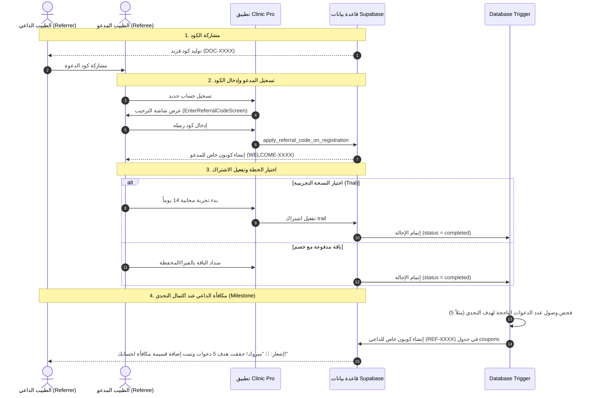

# الدليل الشامل لمنطق العمل والـ Workflows: نظام الإحالة والمكافآت (Referral System)

---

## 1. المعمارية العامة ومبدأ العمل (Architecture Overview)

يعتمد نظام الإحالة (Referrals) على مبدأ **Zero Client Trust (معالجة السيرفر الآمنة)** لضمان نزاهة تتبع الدعوات واحتساب المكافآت:
1. **توليد أكواد الإحالة:** يتم تلقائياً لكل مالك عيادة (Owner) عند إنشاء الحساب عبر Database Trigger (`trg_on_owner_created_generate_referral_code`).
2. **تسجيل واستخدام الكود للمدعو (Referee):**
   - بعد التسجيل، تظهر شاشة الترحيب وإدخال كود الدعوة (`EnterReferralCodeScreen`).
   - يتم التأكد من أن الطبيب المدعو **لم يسبق له أي اشتراك مدفوع سابق** (يُسمح فقط بالتجريبي `trail`).
   - يتم توليد **كوبون ترحيبي خاص** للمدعو (`scope = 'private'`).
   - يتم حفظ الكود وتوجيه الطبيب لاختيار الخطة أو الدفع:
     - إذا كانت المكافأة أيام/شهور مجانية: تفعيل فوري ومجاني للاشتراك عبر `redeem_coupon`.
     - إذا كانت المكافأة نسبة خصم: يتم تطبيق الكوبون تلقائياً في شاشة الدفع ليخصم من الإجمالي.
3. **شرط إتمام الإحالة (Referral Completion):**
   - تتحول حالة الإحالة إلى `completed` فور:
     - بدء اشتراك تجريبي (`subscription_type = 'trail'`).
     - أو نجاح دفع أول اشتراك عبر Paymob.
     - أو تفعيل الباقة المجانية الممنوحة كهدية ترحيبية.
4. **احتساب المكافآت والأهداف للداعي (Referrer Milestones):**
   - عند اكتمال عدد الدعوات المطلوب للمحطة (مثلاً دعوة 3 أو 5 أطباء)، يقوم السيرفر عبر الـ Trigger (`trg_on_referral_completed`) بتوليد **كوبون خاص (Private Coupon)** للداعي بدلاً من التمديد التلقائي المباشر، ليتمكن الداعي من استخدامه عند التجديد أو الترقية.

---

## 2. مخطط تدفق دورة الإحالة والمكافآت (Referral Lifecycle)

---

## 3. الجداول وقواعد البيانات الخاصة بنظام الإحالة

### 1. `Owners`
- حقل `referral_code` الفريد لكل طبيب.

### 2. `referral_redemptions`
- يربط الداعي (`referrer_owner_id`) بالمدعو (`referee_owner_id`) مع حالة الدعوة (`status: pending / completed`).

### 3. `referral_milestone_rewards`
- يحدد أهداف الدعوات والمكافآت الممنوحة.

### 4. `owner_claimed_milestones`
- يوثق الأهداف المحققة والكوبونات الممنوحة للداعي لمنع التكرار.

### 5. `coupons`
- يستقبل جميع الكوبونات الخاصة الناتجة عن الدعوات (`scope = 'private'`) للداعي والمدعو على حد سواء.

