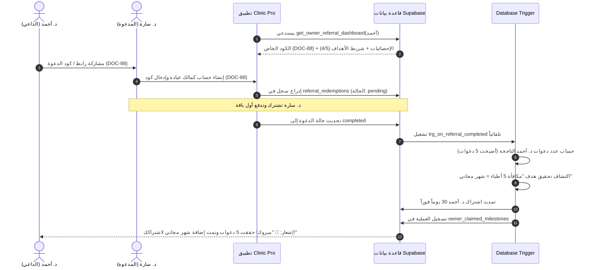

# الدليل الشامل لمنطق العمل والـ Workflows: نظام الإحالة والمكافآت (Referral System)

---

## 1. المعمارية العامة ومبدأ العمل (Architecture Overview)

يعتمد نظام الإحالة (Referrals) على مبدأ **Zero Client Trust (معالجة السيرفر الآمنة)** لضمان نزاهة تتبع الدعوات واحتساب المكافآت:
1. **توليد أكواد الإحالة:** يتم تلقائياً لكل مالك عيادة (Owner) عند إنشاء الحساب عبر PostgreSQL Functions & Triggers.
2. **تسجيل ومتابعة الدعوات:** يتم ربط الطبيب المدعو بالداعي في حالة `pending`، ولا تُحتسب الدعوة ناجحة إلا عند دفع أول اشتراك وتتحول الحالة إلى `completed`.
3. **احتساب المكافآت والأهداف (Milestones):** يتم تلقائياً عبر Database Triggers فور اكتمال الدعوة، مع تمديد الاشتراك فوراً أو توليد كوبونات خصم خاصة.

---

## 2. مخطط تدفق دورة الإحالة والمكافآت (Referral & Milestones Lifecycle)

---

## 3. الجداول وقواعد البيانات الخاصة بنظام الإحالة

### 1. `Owners / Profiles` (بيانات المالك وكود الدعوة)
- يحتوي جدول الملاك على حقل `referral_code` (Unique Referral Code).
- يتم توليده تلقائياً بواسطة Database Trigger عند تسجيل الطبيب كـ `clinic_owner`.

### 2. `referral_redemptions` (سجل تتبع الدعوات)
- يسجل كل محاولة استخدام لكود الإحالة من قبل طبيب جديد.
- **الحالات (Status):**
  - `pending`: تم استخدام الكود عند التسجيل ولكن لم يقم المدعو بالدفع بعد.
  - `completed`: قام المدعو بدفع أول اشتراك بنجاح، وهنا تُحتسب الدعوة للداعي.
  - `cancelled`: تم إلغاء العملية أو استرجاع الدفع.

### 3. `referral_milestone_rewards` (قواعد ومستويات الأهداف)
- يحدد الجوائز الممنوحة عند الوصول لعدد معين من الدعوات الناجحة:
  - **1 زميل:** كوبون خصم 15% للداعي + خصم 20% ترحيبي للمدعو.
  - **3 زملاء:** كوبون خصم 25% للداعي + خصم 20% ترحيبي للمدعو.
  - **5 زملاء:** تمديد فوري للاشتراك لمدة شهر مجاناً (30 يوماً).
  - **10 زملاء:** تمديد فوري للاشتراك لمدة 3 أشهر مجاناً (90 يوماً).

### 4. `owner_claimed_milestones` (سجل الجوائز المكتسبة)
- يوثق الأهداف والمكافآت التي حصل عليها كل طبيب.
- يمنع تكرار منح نفس الجائزة للمستوى نفسه عبر القيد `UNIQUE(owner_id, milestone_id)`.

---

## 4. الدوال و الـ RPCs الرئيسية

| الدالة / الـ RPC | الوصف |
| :--- | :--- |
| `get_owner_referral_dashboard(p_owner_id)` | جلب بيانات لوحة تحكم الإحالات (كود الإحالة، إجمالي الدعوات، الدعوات الناجحة، قائمة الأهداف المحققة والقادمة). |
| `apply_referral_code_on_registration(p_referral_code, p_referee_owner_id)` | التحقق من صحة كود الإحالة وتسجيله أثناء عملية إنشاء الحساب وتوليد الهدية الترحيبية للمدعو فوراً. |
| `trg_on_referral_completed` | Trigger يعمل تلقائياً عند اكتمال الدعوة ودفع الاشتراك لفحص الأهداف وتوزيع المكافآت. |
