# 🌐 دليل وسير عمل نظام دعوة الأطباء والكوبونات (Referrals & Coupons Workflow)

هذا المستند يشرح بالكامل **دورة حياة ونظام عمل الإحالات ودعوة الزملاء (Referrals System)** في تطبيق **Clinic Pro**، موضّحاً تدفق البيانات بين **التطبيق (Flutter App)** و **قاعدة بيانات وسيرفر Supabase**، مع كافة الـ **RPCs** و **Triggers** ونظام استهلاك النقاط.

---

## 🏗️ 1. مخطط تدفق النظام (Referrals System Architecture & Flow)

```mermaid
graph TD
    %% المرحلة الأولى: إنشاء حساب الداعي وتوليد الكود
    subgraph Stage1["1️⃣ إنشاء حساب المالك وتوليد كود الدعوة"]
        OwnerRegister["تسجيل حساب مالك عيادة جديد"] --> Trg_OwnerCode["⚡ Trigger: trg_on_owner_created_generate_referral_code"]
        Trg_OwnerCode --> GenCode["توليد كود فريد تلقائياً<br/>DOC-A1B2C وحفظه بجدول Owners"]
    end

    %% المرحلة الثانية: إدخال الكود وتوليد هدية المدعو
    subgraph Stage2["2️⃣ إدخال كود الدعوة وتوليد هدية المدعو"]
        RefereeInput["الطبيب المدعو يدخل الكود<br/>أثناء التسجيل"] --> Cubit_Apply["ReferralCubit.applyReferralCode()"]
        Cubit_Apply --> RPC_Apply["⚡ RPC: apply_referral_code_on_registration()"]
        RPC_Apply --> CheckCode{"التحقق من الكود<br/>وعدم وجود اشتراك سابق"}
        CheckCode -- "غير صالح / غير مؤهل" --> ErrorMsg["رسالة خطأ للمستخدم"]
        CheckCode -- "صالح" --> GenRefereeCoupon["🎁 إنشاء كوبون ترحيبي خاص للمدعو<br/>WELCOME-XXXX في جدول coupons"]
        GenRefereeCoupon --> InsertRedemption["إدراج سجل الدعوة بجدول<br/>referral_redemptions (status: pending)"]
    end

    %% المرحلة الثالثة: بدء اشتراك المدعو وإتمام الدعوة
    subgraph Stage3["3️⃣ بدء اشتراك المدعو وتفعيل الدعوة"]
        RefereeSub["المدعو يبدأ أول اشتراك<br/>(خطة تجريبية Trial أو مدفوعة)"] --> InsertSub["INSERT / UPDATE في جدول subscriptions"]
        InsertSub --> Trg_Sub["⚡ Trigger: trg_subscription_referral_completion"]
        Trg_Sub --> UpdateRedemption["تحديث حالة الدعوة إلى<br/>status = completed"]
    end

    %% المرحلة الرابعة: معالجة مكافآت الداعي واستهلاك النقاط
    subgraph Stage4["4️⃣ احتساب المكافآت واستهلاك رصيد الدعوات للداعي"]
        UpdateRedemption --> Trg_Reward["⚡ Trigger: trg_on_referral_completed"]
        Trg_Reward --> CalcPoints["حساب الرصيد المتاح:<br/>Available = Successful - Consumed"]
        CalcPoints --> CheckMilestone{"هل الرصيد المتاح يكفي<br/>لتحقيق الهدف القادم؟"}
        CheckMilestone -- "نعم" --> GenReferrerCoupon["🏆 توليد كوبون مكافأة الداعي<br/>REF-XXXX في جدول coupons"]
        GenReferrerCoupon --> ClaimMilestone["توثيق استلام المحطة بجدول<br/>owner_claimed_milestones وخصم النقاط"]
        CheckMilestone -- "لا" --> WaitMore["في انتظار اكتمال دعوات أخرى"]
    end

    %% المرحلة الخامسة: لوحة تحكم ومكافآت الداعي
    subgraph Stage5["5️⃣ لوحة تحكم الداعي واستخدام الكوبونات"]
        OpenDashboard["الداعي يفتح شاشة المكافآت"] --> RPC_Dashboard["⚡ RPC: get_owner_referral_dashboard()"]
        RPC_Dashboard --> ShowUI["عرض الرصيد المتاح والأهداف والشارات"]
        UseCoupon["استخدام الكوبون عند الترقية/الاشتراك"] --> RPC_Redeem["⚡ RPC: redeem_coupon()"]
        RPC_Redeem --> ApplyDiscount["تطبيق الخصم / الشهور المجانية بالسيرفر"]
    end

    %% الربط بين المراحل
    GenCode -.-> RefereeInput
    InsertRedemption -.-> RefereeSub
    ClaimMilestone -.-> OpenDashboard
```

---

## ⚙️ 2. المشغلات السحابية (Triggers) على السيرفر

| # | اسم الـ Trigger | الجدول المستهدف | وقت التنفيذ (Event) | الوظيفة ودور العمل |
|---|---|---|---|---|
| **1** | `trg_on_owner_created_generate_referral_code` | `public.Owners` | `BEFORE INSERT` | توليد كود إحالة فريد آلياً بصيغة `DOC-XXXXX` لكل مالك عيادة جديد عند التسجيل. |
| **2** | `trg_subscription_referral_completion` | `public.subscriptions` | `AFTER INSERT OR UPDATE OF status` | عندما يصبح اشتراك الطبيب المدعو `active` (سواء Trial أو مدفوع لأول مرة)، يقوم تلقائياً بتحويل حالة الدعوة في `referral_redemptions` من `pending` إلى `completed`. |
| **3** | `trg_on_referral_completed` | `public.referral_redemptions` | `AFTER INSERT OR UPDATE OF status` | المحرك الأساسي للمكافآت: يعمل فور اكتمال أي دعوة، يحسب **الرصيد المتاح** عبر معادلة استهلاك النقاط، وإذا حقق الداعي هدف المحطة يُنشئ له كوبون مكافأة خاص `REF-XXXX` ويوثقه في `owner_claimed_milestones`. |

---

## 🧮 3. الإجراءات المخزنة (RPCs) واستخداماتها

### 1️⃣ `apply_referral_code_on_registration`
- **الهدف**: تفعيل كود الدعوة أثناء إنشاء حساب الطبيب المدعو.
- **المدخلات**: `(p_referral_code: VARCHAR, p_referee_owner_id: UUID)`
- **خطوات التحقق والمعالجة**:
  1. التحقق من وجود كود الدعوة في جدول `Owners`.
  2. منع الطبيب من استخدام كود الدعوة الخاص به.
  3. التحقق من أن الطبيب المدعو ليس لديه اشتراكات مدفوعة سابقة.
  4. جلب قواعد الهدية المخصصة للمدعو وتوليد كوبون ترحيبي خاص `WELCOME-XXXX` في جدول `coupons` بصلاحية 90 يوماً.
  5. إدراج سجل جديد في جدول `referral_redemptions` بحالة `pending`.

---

### 2️⃣ `get_owner_referral_dashboard`
- **الهدف**: جلب البيانات الشاملة لشاشة المكافآت والإحالات الخاصة بمالك العيادة.
- **المدخلات**: `(p_owner_id: UUID)`
- **المخرجات (JSON)**:
  - `referral_code`: كود الإحالة الخاص بالمالك.
  - `total_invites`: إجمالي عدد الدعوات المسجلة.
  - `successful_invites`: عدد الدعوات المكتملة بنجاح.
  - `available_invites`: رصيد الدعوات الفعلي المتاح لاستهلاكه في التحديات القادمة.
  - `milestones`: قائمة التحديات والأهداف مرتبة تصاعدياً موضحاً فيها (الهدف، العنوان، مكافأة الداعي والمدعو، هل تم تحقيقها `is_achieved`، وهل تم استلامها `is_claimed` مع كود الكوبون الناتج).

---

### 3️⃣ `validate_coupon` & `redeem_coupon`
- **الهدف**: فحص وتطبيق الكوبونات المولدة من نظام الإحالات أثناء الاشتراك.
- **المعالجة**:
  - فحص نوع الكوبون (عام `public` أو خاص بالمالك `private`).
  - حساب الخصم المئوي / المالي أو تمديد الأيام المجانية بالسيرفر مباشرة لمنع أي تلاعب.
  - في حال كان الكوبون مجانياً (خصم 100% أو شهر مجاني)، يُنشئ تلقائياً سجلاً في `payment_transactions` بقيمة `0.00 EGP` ووسيلة دفع `coupon`.

---

## 🔄 4. آلية استهلاك نقاط الدعوات (Points / Invites Consumption Model)

يعتمد النظام أسلوب **استهلاك رصيد الدعوات** لضمان استدامة المكافآت ومنع تكرار احتساب نفس الطبيب المدعو في أكثر من محطة بشكل غير عادل:

$$\text{Available Invites} = \text{Successful Completed Invites} - \sum (\text{Consumed Targets in Claimed Milestones})$$

### مثال عملي:
- **المحطة الأولى**: دعوة طبيبين (2 أطباء) 🎁 **المكافأة**: خصم 50%.
- **المحطة الثانية**: دعوة 5 أطباء 🎁 **المكافأة**: شهر مجاني.

1. دعا الطبيب زميلين مكتملين $\rightarrow$ الرصيد المتاح = 2.
2. يتم تحقيق المحطة الأولى واستلامها $\rightarrow$ تُستهلك 2 دعوة، ويصبح الرصيد المتاح = 0.
3. يحتاج الطبيب إلى دعوة **5 أطباء جدد إضافيين** للوصول للمحطة الثانية واستلام الشهر المجاني.
