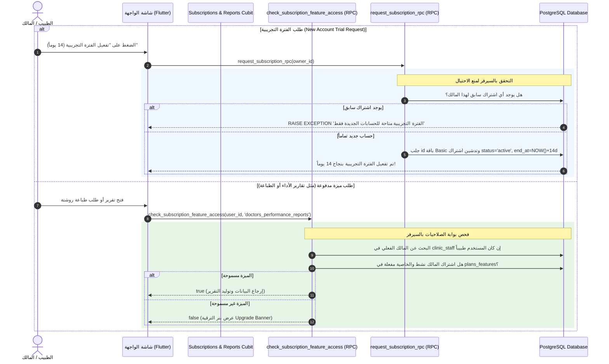

# الدليل الشامل لمنطق العمل والـ Workflows: نظام الاشتراكات والباقات (Subscriptions & Feature Gate System)

---

## 1. المعمارية العامة ومبدأ العمل (Architecture Overview)

يعتمد نظام الاشتراكات والباقات في **Clinic Pro** بالكامل على معمارية **Centralized Feature Gate (بوابة الصلاحيات المركزية بالسيرفر)** لضمان أمان النظام وحماية الميزات المدفوعة:

1. **التحقق من الصلاحيات بالسيرفر حصراً (Server-Side Feature Gate):** 
   - تمنع قاعدة البيانات أي حساب من الوصول للتقارير المتقدمة أو طباعة الروشتات إلا إذا كانت باقته الحالية تدعم هذه الميزة.
   - يتم الفحص المركزي داخل PostgreSQL عبر دالة `check_subscription_feature_access(p_owner_id, p_feature_key)`.
2. **تتبع مالك العيادة التابع (Inherited Owner Permissions):** 
   - إذا كان المستخدم الحالي **طبيباً أو سكرتيراً** وليس المالك مباشرة، تقوم دالة الفحص في السيرفر بالبحث التلقائي عبر `JOIN` بين `clinic_staff` و `clinics` للوصول لمالك العيادة الفعلي وجلب حالة اشتراكه دون الحاجة لطلب المعرف يدوياً من العميل.
3. **أنواع الاشتراكات (`subscription_types`):**
   - **فترة تجريبية (`trail`):** مجانية لمدة 14 يوماً وتتاح مرة واحدة فقط لكل حساب جديد عبر `request_subscription_rpc`.
   - **شهري (`monthly`):** اشتراك يتجدد شهرياً.
   - **سنوي (`yearly`):** اشتراك يتجدد سنوياً بخصم موفر.
   - **مدى الحياة (`lifetime`):** اشتراك يدفع مرة واحدة وتكون نهاية الاشتراك غير محدودة (`end_at = NULL`).
4. **حالات الاشتراك (`subscription_status`):**
   - `pending`: بانتظار سداد الفاتورة.
   - `active`: اشتراك نشط وساري.
   - `expired`: اشتراك منتهي الصلاحية (`end_at < NOW()`).
   - `cancelled`: اشتراك ملغى.
5. **الحدود القصوى للباقات (Plan Limits Enforcement):**
   - تحدد كل باقة سقفاً أقصى لعدد العيادات (`max_clinics`)، الأطقم الطبية (`max_staff`)، والمرضى (`max_patients`) المسجلين في جدول `plans_features`.

---

## 2. مخطط تدفق فحص وإدارة الاشتراكات (Subscriptions & Feature Gate Workflow)



---

## 3. الجداول وقواعد البيانات الخاصة بنظام الاشتراكات

### 1. `plans` (جدول الباقات)
- **الحقول الأساسية:**
  - `id`: المعرف الفريد للباقة (UUID).
  - `name`: اسم الباقة (`basic`, `pro`, `enterprise`).
  - `monthly_price` & `monthly_price_egp`: سعر الاشتراك الشهري بالدولار والجنيه.
  - `yearly_price` & `yearly_price_egp`: سعر الاشتراك السنوي.
  - `lifetime_price` & `lifetime_price_egp`: سعر الاشتراك مدى الحياة.
  - `monthly_discount`, `yearly_discount`, `lifetime_discount`: نسبة الخصم المعروضة.

### 2. `plans_features` (حجم الميزات وسقف الباقة)
- **الحقول الأساسية:**
  - `id`: المعرف الفريد (UUID).
  - `plan_id`: معرف الباقة المرتبطة (FK -> `plans.id`).
  - `max_clinics`: الحد الأقصى لعدد العيادات المسموح بها.
  - `max_staff`: الحد الأقصى للأطقم الطبية (أطباء وسكرتارية).
  - `max_patients`: الحد الأقصى لعدد المرضى المسجلين.
  - `features`: كائن JSONB يحتوي على مفاتيح تشغيل الميزات، مثل:
    - `print_reports`: ميزة طباعة وتصدير التقارير.
    - `clinics_reports`: ميزة تقارير العيادات.
    - `appointments_reports`: ميزة تقارير المواعيد.
    - `doctors_performance_reports`: ميزة تقارير أداء الأطباء.
    - `prescriptions_reports`: ميزة تقارير الأدوية والروشتات.

### 3. `subscriptions` (جدول الاشتراكات الفعالة)
- **الحقول الأساسية:**
  - `id`: المعرف الفريد للاشتراك (UUID).
  - `owner_id`: معرّف الطبيب المالك صاحب الاشتراك (FK -> `users.id`).
  - `plan_id`: معرّف الباقة الحالية (FK -> `plans.id`).
  - `subscription_type`: نوع الاشتراك (`trail`, `monthly`, `yearly`, `lifetime`).
  - `status`: حالة الاشتراك (`pending`, `active`, `expired`, `cancelled`).
  - `started_at`: تاريخ ووقت بدء تفعيل الاشتراك.
  - `end_at`: تاريخ ووقت انتهاء الاشتراك (`NULL` في حالة `lifetime`).
  - `payment_method` & `payment_status` & `transaction_id`: بيانات عملية السداد البنكية.

---

## 4. الدوال والـ RPCs الرئيسية

| الدالة / الـ RPC | الوصف والمسؤولية |
| :--- | :--- |
| `request_subscription_rpc(p_owner_id)` | إنشاء اشتراك تجريبي مجاني (`trail`) لمدة 14 يوماً بحماية سيرفر تمنع التكرار نهائياً. |
| `check_subscription_feature_access(p_owner_id, p_feature_key)` | دالة الفحص المركزية التي تجلب المالك وتتحقق من صلاحية الميزة المحددة بحساب المالك. |
| `get_financial_report_rpc(...)` | تقرير المستحقات والإيرادات المالية المحمي بـ Feature Gate. |
| `get_doctors_performance_report_rpc(...)` | تقرير أداء ونشاط الأطباء المحمي بـ Feature Gate. |
| `get_prescriptions_report_rpc(...)` | تقرير الأدوية والروشتات الأكثر استخداماً والمحمي بـ Feature Gate. |
| `verify_print_report_access_rpc(...)` | التثبت السيرفري من صلاحية الطبيب لطباعة وتصدير التقرير الحالي. |

---

## 5. قواعد الأمان والـ RLS (Row Level Security)

```sql
-- تفعيل حماية RLS لجدول الاشتراكات
ALTER TABLE subscriptions ENABLE ROW LEVEL SECURITY;

-- المالك فقط يستطيع القراءة والرؤية لاشتراكه الخاص
CREATE POLICY "owners_view_own_subscriptions"
  ON subscriptions FOR SELECT
  USING (
    auth.uid() = owner_id 
    OR EXISTS (
      SELECT 1 FROM clinic_staff cs 
      JOIN clinics c ON c.id = cs.clinic_id 
      WHERE cs.user_id = auth.uid() AND c.owner_id = subscriptions.owner_id
    )
  );

-- الإدراج والتعديل يتم حتماً عبر RPCs المعتمدة السيرفرية (SECURITY DEFINER)
```

- **تنبيه أمني:** لا يستطيع العميل إنشاء أو تمديد السجل في جدول `subscriptions` مباشرة، ويتم الاعتماد كلياً على الـ RPCs ذات حماية `SECURITY DEFINER` و الـ Edge Functions لحفظ توازن البيانات وأمان النظام.
